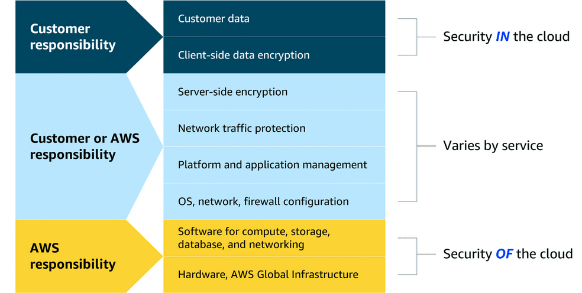

# Module 1: Introduction to the Cloud

## Describe the client-server model at a fundamental level.

**An example a coffee shop:**

You only pay for what you use.

--- 
## What is Cloud Computing?
On-demand **delivery on IT resources** _over the internet_ with pay-as-you-go pricing.

Definitions of cloud computing:
- **On-demand delivery:** customers can access computing resources, such as storage or compute power,
within seconds and as needed. Users can scale their resource usage up or down based on current 
requirements without lengthy provisioning processes.
- **of IT resources:** the wide array of information technology assets in the cloud-computing space. 
These resources include servers, storage solutions, databases, networking components, artificial 
intelligence and machine learning (AI/ML) tools, and more. Customers can use these resources to build, 
deploy, and manage applications and services through the cloud infrastructure.
- **over the internet:** cloud computing delivers IT resources through internet connectivity. 
This means that users access and use these resources through web-based services rather than maintaining local hardware or software. The internet acts as the conduit, which provides remote access to compute 
power, storage, and applications from anywhere in the world.
- **with pay-as-you-go-pricing:** Flexible pricing is a fundamental economic aspect of cloud computing.
Users pay only for the resources they actually consume, rather than committing to fixed, long-term 
contracts. This usage-based pricing model offers cost efficiency and financial flexibility.

### Cloud deployment types
1. **Cloud:** you have the flexibility to migrate your existing resources to the cloud, design and 
build new applications within the cloud environment, or use a combination of both.
2. **On-premises:** Deploying resources on premises using virtualization and resource management 
tools does not provide many of the benefits of cloud computing. However, it is sometimes sought for 
its ability to provide dedicated resources and low latency.
3. **Hybrid:** cloud-based resources and on-premises infrastructure work together. This approach is 
ideal for situations where legacy applications must remain on premises due to maintenance preferences
or regulatory requirements.

## Benefits of the AWS Cloud
Six key benefits of cloud computing.

### The ability to pay as you go
**The Cloud is Like Renting a LEGO Set!**

Imagine you love building with LEGOs.

*   **Old Way (On-Premises):** You have to go to the store and **buy** a huge, expensive LEGO castle set. You must pay the whole big price **right now**, even if you only want to build a tiny tower today. You also need a big table at home just for it, and you have to keep it clean.

*   **Cloud Way (with AWS):** Instead of buying it, you go to a **LEGO Library** (that's the cloud!). Here, you can just **borrow** the pieces you need. Want to build a tiny tower? Just take a few bricks, and you only pay for those bricks. Tomorrow, if you want to build a huge castle, you borrow more bricks and pay a little more. You only pay for what you use, **right when you use it**. You don't need the big table at home anymore, and the library keeps everything clean and working.

**What that means for a business:**
With the old way, they spend a **big, fixed** amount of money all at once (like buying the whole LEGO set). With the AWS cloud, they pay a **changing** amount each month, just for what they actually use. They can start small and cheap, and grow whenever they want!

### **Easy-Peasy Cloud Superpowers with AWS!**

Here are more cool things the cloud (AWS) lets you do:

**1. Super Discounts for Everyone!**
Think of AWS as a giant that buys toys (servers and computers) for all its friends. Because it buys **SO MANY**, it gets a **huge discount**. Then, it shares those cheap prices with you! You get to pay less because AWS buys so much.

**2. No More Guessing Games!**
Imagine you're having a party.
*   **Old Way:** You have to guess **months ahead** how many people are coming. If you guess too high, you buy way too much pizza and it goes to waste. If you guess too low, you run out of food and your friends are sad!
*   **Cloud Way:** You can order pizza **by the slice, minute by minute**. More friends show up? Instantly order more slices. Friends leave? Stop ordering. You **never run out** and **never waste** food. AWS lets you add or remove computer power just as fast.

**3. Super Speed for Inventing!**
With AWS, you can build a new lemonade stand (a new app or idea) in **just a few minutes**. If you don't like how it turns out, you can take it down just as fast and **only pay for the minutes you tried it**. This lets you invent and try new things super quickly without a big mess or cost!

**4. No More Chores!**
Running your own computer room (data center) is like having a really high-maintenance pet. You have to feed it (pay for power), clean it (maintenance), and watch it all the time.
With AWS, **they take care of the pet for you!** All the boring, hard work of keeping the computers running is their job. This frees up your time to play with your friends (or focus on your customers).

**5. Be Anywhere in the World Instantly!**
Let's say your awesome online game is a hit in your hometown.
*   **Old Way:** To let kids in **India** play, you'd have to **build a whole new computer room in India**. That takes years!
*   **Cloud Way:** AWS already has computer rooms **all over the world**. With just a few clicks, you can copy your game to their computer room in India **in minutes**. Now kids everywhere can play fast, without you building anything!

**In short, AWS gives you magic powers:**
💸 **Giant Discounts** | 🎯 **Never Guess Wrong** | ⚡ **Invent Super Fast**
🧹 **No More Chores** | 🌍 **Go Global in a Click**

## Introduction to AWS Global Infrastructure

Think of it like your favorite ice cream shop, **"Cloudy Cones."**

**The Problem: One Shop is Risky**
Imagine **Cloudy Cones** has only **one shop**. If something goes wrong there—like the ice cream machine breaks, the power goes out, or someone spills a milkshake on all the electrical outlets—the whole shop has to **close**. No one can get ice cream! The business stops making money until it's fixed.

**The Solution: Lots of Shops! (This is AWS)**
Now, imagine **Cloudy Cones** is a **huge chain** with shops **all over the world**. This is like AWS's **Global Infrastructure**.

*   **Regions:** These are like **different countries or big areas**. Examples: "Cloudy Cones - North America," "Cloudy Cones - Europe," "Cloudy Cones - Asia." AWS has places like Ohio, Tokyo, and Paris.
*   **Availability Zones (AZs):** Inside each big area (Region), there isn't just **one** shop. There are **at least three separate, special shops** (AZs). They are built in different neighborhoods so a problem in one (like a storm or a power cut) won't affect the others.

**How This Helps You (High Availability & Fault Tolerance):**

1.  **No Single Point of Failure:** If a latte (or a storm) ruins **one shop (one AZ)**, the other two shops in the same **city (Region)** are still open! Customers can just go to the next closest shop. Your ice cream business (your website or app) **stays open**.
2.  **Super Safe (Fault Tolerance):** You can even design your ice cream stand to use **all three shops at once**. If one breaks, the other two automatically handle all the customers without anyone even noticing. The system is built to **keep running** even if parts break.
3.  **Global Reach:** If a huge problem (like a very big disaster) affects the whole **city (Region)**, your business can still run because you have shops in **other cities/countries (other AWS Regions)**! You can quickly direct your customers to a shop on another continent.

**Simple Summary:**
AWS doesn't keep all its computers in one building. It spreads them out in:
*   **Many Regions** (different parts of the world)
*   **Many Availability Zones** (multiple separate buildings within each Region)

This way, if something bad happens in one place, your app or website doesn't go down. It's always available, just like you could always get ice cream if your favorite shop has locations everywhere!

So, you can relax knowing your online business is safe from spills, storms, and other surprises!

## The AWS Shared Responsibility Model

Imagine you buy a brand new, very secure **house**.

**1. The Builder's Job (AWS's Job):**
The builder (AWS) is responsible for making the **house itself safe**.
*   They build strong **walls** and a solid **foundation** (the cloud's physical security).
*   They install good **locks on the doors and windows** (the cloud's network and hypervisor security).
*   They make sure the **neighborhood is safe** (the security *of* the cloud).

Their job is to give you a **safe, strong house** to live in.

**2. Your Job (The Customer's Job):**
Once you move in, the builder's job is mostly done. Now it's **your turn** to be responsible for what's **inside the house** (security *in* the cloud).
*   You must **lock the doors and windows** you were given. (If you leave them open, that's on you!)
*   You are in charge of everything **inside**:
    *   **Your Family (Your Operating System):** You decide who gets a key (password) to come in. You must feed them and keep them healthy (install updates and patches).
    *   **Your Stuff (Your Applications & Data):** You decide where to put your valuables. You can lock them in a safe (encrypt your data). You choose who gets to see your family photos or your secret diary.

**The Big Rule:**
*   **AWS's Job:** Securing the **cloud itself** (the house, the neighborhood).
*   **Your Job:** Securing what you **put in the cloud** (your stuff inside the house).

**Why This is Great:**
AWS gives you the **tools** (strong locks, safes, alarms) to be super secure. But **you** have to **use them**. It’s a **team effort**!
*   AWS makes sure no one can break the walls of your house.
*   **You** make sure to lock the door so your little brother doesn't eat all your cookies (or so hackers can't get your data).

**In a tiny nutshell:**
**AWS = Security OF the Cloud.** (The strong house)
**You = Security IN the Cloud.** (Locking your door and protecting your stuff inside).

Together, you make a super-safe home for your apps and data!

## Components of the AWS Shared Responsibility Model
