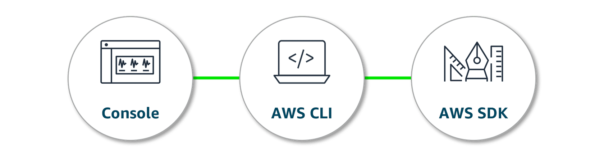

# Introduction to Amazon EC2

Remember our **coffee shop**? The **employee** who takes your order and makes your coffee is like a **server**. You (the customer) are the **client** who sends a request ("One latte, please!") and gets a response (the delicious latte).

**What is EC2?**
EC2 is like having a **virtual employee/computer in the cloud** that works for your business. Instead of buying and setting up a real, physical computer in a back room (which is slow and expensive), you can **rent a virtual one from AWS in minutes**.

*   **It's Fast:** You can get one running in **just a few minutes** by asking AWS for it.
*   **It's Flexible:** You only **pay for the time** it's actually running. Turn it off when you don't need it, and you stop paying!
*   **It's Powerful:** You can make it **bigger or smaller** anytime. Need more power? Make it bigger! Don't need as much? Make it smaller.

**How Does It Work? (The Magic Behind the Scenes)**
Imagine a **super-powerful physical computer** (a host machine) at an AWS data center. A special software called a **hypervisor** lets that one big computer pretend to be **many smaller, separate computers** (these are your EC2 instances).

*   This is called **multi-tenancy** (many "tenants" sharing one host).
*   The **hypervisor's job** is to make sure your virtual computer is completely **isolated and safe** from everyone else's virtual computers on the same machine. **AWS handles all of this for you.**

**You Are in Control!**
When you get your EC2 instance (your virtual computer), **you decide**:
1.  **The Operating System:** Do you want **Windows** or **Linux**?
2.  **The Software:** What do you want it to run? Your website? A game? A database? You install whatever you need.
3.  **The Size:** Start small. If you need more memory or a faster brain (CPU), you can **vertically scale** (make it bigger) with just a few clicks.
4.  **The Access:** You decide who can talk to it (like setting rules for who can visit your coffee shop).

**The Big Idea:**
AWS took the old idea of virtual computers (VMs) and made it **incredibly easy and cheap** to use. You get all the benefits of a powerful server **without** the hassle of buying, maintaining, and powering a physical machine. It's **Compute as a Service**—you just use the computing power you need, when you need it.

**Simple Summary:**
**EC2 = Your rent-a-computer in the cloud.**  
It's fast to get, easy to change, and you only pay while it's on. AWS keeps the physical machine safe and isolated, and you get to control everything that happens on your virtual computer.

## Key Takeaways: Your Cloud Computer (EC2) vs. Owning a Computer

Think of it like getting a computer for your business:

### **The Old Way (On-Premises): Like Buying a Whole Computer Store**
*   You have to **buy all the computers upfront**—a huge cost before you even start.
*   You have to **wait weeks** for them to be delivered.
*   You're **stuck** with what you bought. If you need more power later, you have to buy more. If you need less, you've wasted money.
*   You have to **set up, power, and fix** everything yourself.

**It's slow, expensive, and rigid.**

### **The AWS Cloud Way (EC2): Like Having a Magic Computer Vending Machine**
*   You can get a **virtual computer in minutes**, not weeks.
*   You **only pay** for the time it's turned on.
*   You can make it **bigger or smaller** with a click as your needs change.
*   **No maintenance**—AWS keeps the physical machines running.
*   It's **fast, flexible, and cost-effective.**

### **How to Use Your Cloud Computer (EC2) in 3 Easy Steps:**

**Step 1: Pick Your Computer (Launch)**
*   Go to the AWS "vending machine" and choose:
    *   **The Software (AMI):** Do you want Windows or Linux on it? Maybe with extra programs pre-installed?
    *   **The Size (Instance Type):** How powerful? A little computer for a small website, or a giant one for a big game?

**Step 2: Log In (Connect)**
*   Once it's running, you connect to it from your own laptop.
*   For **Linux**, you use `SSH` (like a secure phone call to the computer).
*   For **Windows**, you use `RDP` (like remotely controlling its screen).

**Step 3: Start Working (Use)**
*   Now it's yours! Use it just like any other computer:
    *   Install your website or app.
    *   Save files on it.
    *   Run your programs.

When you're done, just **turn it off** and stop paying!

---

**In a Nutshell:**
EC2 turns computing into a **utility**. You get **exactly the computer power you need, exactly when you need it**, without any of the headaches of owning physical hardware. It’s the foundation for running almost anything in the AWS cloud.

## **Amazon EC2 Instance Types Like Coffee Machines**

Think of EC2 instances as **different coffee machines** in a coffee shop. You need the right machine for each drink to run your shop efficiently.

### **The 5 "Coffee Machine" Families (Instance Types):**

1.  **General Purpose (The All-Rounder)**
    *   **Like:** A **good standard coffee maker** that can make decent espresso, drip coffee, and even froth milk okay. It does everything well.
    *   **Use it for:** Websites, app backends, or when you're just starting and aren't sure what you need. It's a safe, balanced choice.

2.  **Compute Optimized (The Speed Demon)**
    *   **Like:** A **super-fast, high-powered espresso machine** designed to pump out perfect shots as quickly as possible.
    *   **Use it for:** Tasks that need raw brainpower (CPU): video encoding, scientific simulations, game servers, or complex calculations.

3.  **Memory Optimized (The Big-Thinker)**
    *   **Like:** A **huge, specialized cold-brew tower** that needs to hold gallons of coffee in its system to work properly.
    *   **Use it for:** Workloads that need to hold **a lot of information in memory** at once: big databases, real-time analytics, or caching systems.

4.  **Accelerated Computing (The Specialized Artist)**
    *   **Like:** A **fancy, automated latte art machine** with special arms and tools. It uses specialized hardware (GPUs) to do things regular machines can't do efficiently.
    *   **Use it for:** Machine learning, 3D rendering, graphics processing, or complex physics simulations.

5.  **Storage Optimized (The High-Capacity Fridge)**
    *   **Like:** A **massive, super-fast refrigerator** that can instantly store and retrieve gallons of milk and syrup.
    *   **Use it for:** Workloads that need **super-fast read/write access to huge amounts of local data**: data warehouses, large NoSQL databases (like Cassandra), or log processing.

---

### **Size Matters (And So Does Cost!)**
*   Inside each family (like **General Purpose**), you can pick a **size**: small, medium, large, x-large.
*   **Bigger size** = More power (CPU, Memory, Storage) = **Higher cost**.
*   **The Goal:** Pick the **smallest size that does the job well**. Don't rent a monster truck to go to the grocery store. You can always change the size later if you need to!

### **The Superpower of the Cloud: Flexibility**
You are **not stuck** with your first choice! If you pick a `t3.medium` and realize you need more memory, you can easily change it to an `r5.large`. The cloud lets you **"right-size"** your resources as you learn more about what your application needs.

**Simple Summary:**
| **Instance Family** | **It's Like...** | **Best For...** |
| :--- | :--- | :--- |
| **General Purpose** | Reliable all-rounder coffee maker | Websites, starting out |
| **Compute Optimized** | Fast espresso machine | Number crunching, games |
| **Memory Optimized** | Large cold-brew tower | Big databases, analytics |
| **Accelerated Computing** | Fancy latte art robot | Graphics, machine learning |
| **Storage Optimized** | Super-fast, huge fridge | Big local data storage |

**Choose the right "machine" for the "drink" (workload) you're making!**

## **How to Provision AWS Resources**

**How to Talk to AWS: 3 Ways (Like Ordering Coffee)**

Think of AWS as a giant coffee shop with a huge, automated kitchen. To get what you need (like a virtual computer or storage), you have to **place an order**. The "menu" of things you can order is called an **API**.

There are **3 main ways** to place your order:

---

### **1. The Menu Screen (AWS Management Console)**
*   **What it is:** A **visual website** (like a touchscreen menu) where you click buttons, fill in forms, and see pictures of what you're ordering.
*   **It's great for:**
    *   **Learning** how AWS works.
    *   **One-time tasks** or setting up a test environment.
    *   Checking your bill or monitoring resources.
*   **The downside:** It's **slow and manual**. If you want 100 coffees (100 EC2 instances), you have to click through the menu 100 times. You might also make a mistake by clicking the wrong button.

---

### **2. The Text Order (AWS Command Line Interface - CLI)**
*   **What it is:** **Typing commands** in a terminal (like a text message to the coffee shop). You use special text commands to tell AWS exactly what you want.
*   **Example Command:** `aws ec2 run-instances` (This means "AWS, please start a new virtual computer for me.")
*   **It's great for:**
    *   **Automation!** You can write a script (a recipe) once and run it many times to create lots of identical resources.
    *   **Advanced users** who want speed and precision.
    *   Avoiding human clicking errors.
*   **Think of it like:** Sending a detailed text order to the barista instead of pointing at the menu.

---

### **3. The App Order (AWS Software Development Kit - SDK)**
*   **What it is:** **Code libraries** for programming languages (like Python, Java, or JavaScript). You write code in your own application that automatically places orders to AWS.
*   **Example:** Your video game's code could use the Python SDK to automatically launch a new game server (EC2 instance) whenever 50 players join a queue.
*   **It's great for:**
    *   **Developers** building apps that need to control AWS automatically.
    *   Integrating AWS directly into your software.

---

### **Behind the Scenes:**
No matter which of the 3 ways you choose, they all **send the same API calls** to the AWS kitchen. The Console, CLI, and SDK are just different **interfaces** for you to talk to the same system.

---

### Key takeaways: Interacting with AWS services

### **Shared Responsibility with EC2 (The "Unmanaged" Service)**
Remember the **house metaphor**? EC2 is like renting a **bare, empty house**.

*   **AWS's Job (Security *OF* the Cloud):** They provide the strong, safe **house** (the physical server, the hypervisor, the secure data center).
*   **YOUR Job (Security *IN* the Cloud):** Once you get the keys, you are responsible for **everything inside**:
    *   Locking the digital doors (**configuring security groups/firewalls**).
    *   Keeping the software updated (**patching the operating system**).
    *   Installing your own locks and safes (**managing user accounts and encrypting data**).

EC2 gives you **total control**, which means you also have **total responsibility** for keeping it secure and running properly. (Other AWS services are more "managed," where AWS takes care of more of these tasks for you.)

---

**Simple Summary: How to Interact with AWS**

| Method | What It Is | Best For |
| :--- | :--- | :--- |
| **AWS Console** | Point-and-click website | Beginners, learning, quick one-off tasks |
| **AWS CLI** | Text commands in a terminal | Automation, scripting, precise control |
| **AWS SDK** | Code libraries for apps | Developers building apps that use AWS |

## Demo: Launching an Amazon EC2 Instance

**What we just did:** We created a **virtual web server** in the cloud in a few clicks!

**Here's the simple step-by-step we followed:**

1.  **Name It:** Gave our server a nickname so we can find it later.
2.  **Pick the Blueprint (AMI):** Chose a **template** called "Amazon Linux." This template has an operating system (like the brain of the computer) ready to go. Think of it like choosing the **base model** of a car.
3.  **Pick the Size (Instance Type):** Chose `t2.micro`. This is a **small, free** computer size perfect for learning. It has 1 virtual CPU and 1GB of memory.
4.  **Get the Key (Key Pair):** Created a **special digital key** (like a password you can't forget). This is the **only way to log in** to our server later. We must keep this key file safe!
5.  **Set Up Access (Network Settings):** Checked a box to **"Allow HTTP traffic."** This is like telling the security guard, "Let people visit the website on this server."
6.  **Add Storage:** Gave it **8GB of virtual hard drive space** (an EBS volume) to store files.
7.  **Add Special Instructions (User Data):** Told the server to **install a web server software (Nginx)** as soon as it boots up. This is like giving the car factory a note saying, "Please also install a radio before you deliver it."
8.  **LAUNCH!** Clicked the button. A few minutes later, our server was running.

**We then copied its public IP address (its "street address" on the internet) into a browser, and saw our new website!**

---

### **What is an AMI? (The Blueprint/Template)**
An **AMI (Amazon Machine Image)** is a **pre-packaged snapshot** used to launch an EC2 instance. It's like a **cookie cutter**.

*   **What's in an AMI?**
    *   The **Operating System** (like Linux or Windows)
    *   The **storage layout**
    *   Any **pre-installed software** (like a database or web server)
    *   **Launch permissions**

*   **Why are AMIs awesome?**
    1.  **Consistency:** Every server you launch from the same AMI is **identical**. No "it works on my machine" problems!
    2.  **Speed:** Launching a pre-configured server takes **minutes**, not hours.
    3.  **Sources for AMIs:**
        *   **Make Your Own:** Bake your perfect server setup into a custom AMI.
        *   **Use AWS's:** Start with a simple, clean OS (like we did).
        *   **Buy One:** Get pre-built AMIs with special software (like WordPress or SQL Server) from the **AWS Marketplace**.

## Amazon EC2 Pricing
Think of EC2 instances as renting cars for your computing trips. You have different ways to pay depending on how you'll use the car.

---

### **The 6 Ways to "Rent" Your Cloud Computer:**

**1. On-Demand (Pay-as-You-Go)**
*   **Like:** **Renting a car by the hour** from a rental counter.
*   **How it works:** You pay only for the hours (or seconds) the instance runs. **No commitment**. Turn it off, stop paying.
*   **Best for:** Beginners, testing, unpredictable workloads, or short-term projects.
*   **Price:** Standard rate. Most flexible, but highest per-hour cost.

**2. Savings Plans (Budget Commitment)**
*   **Like:** Signing a contract with a car service: *"I promise to spend at least $200/month on rentals for 1 year, and you give me a big discount."*
*   **How it works:** You commit to a **consistent hourly spend** for 1 or 3 years. In return, you get **up to 72% discount** on *all* your compute usage (EC2, Fargate, Lambda).
*   **Best for:** Steady, predictable usage where you can commit to a budget.
*   **Price:** Cheaper than On-Demand if you use what you commit to.

**3. Reserved Instances (RI) (Specific Car Reservation)**
*   **Like:** Pre-paying to **reserve a specific car model** (e.g., a Toyota Camry) for 1-3 years at a huge discount.
*   **How it works:** You commit to a **specific instance type** in a **specific region** for 1 or 3 years. You get **up to 75% discount**.
*   **Best for:** Steady workloads you know will run continuously (like a database or core application server).
*   **Price:** Cheapest option for long-term, predictable use. Less flexible than Savings Plans.

**4. Spot Instances (The Amazing Deal - But Risky)**
*   **Like:** Bidding on **last-minute, unsold rental cars** at the airport for up to **90% off**. The catch: The rental company can take the car back with a 2-minute warning if someone pays full price.
*   **How it works:** You use AWS's **spare compute capacity** at massive discounts. Perfect for workloads that can be **interrupted** (like video rendering, batch processing, scientific computing).
*   **Best for:** Flexible, fault-tolerant, non-urgent jobs.
*   **Price:** Extremely cheap, but unreliable.

**5. Dedicated Hosts (Rent the Whole Garage)**
*   **Like:** **Renting an entire parking garage** for your exclusive use. You control exactly where each car parks.
*   **How it works:** You get a **physical server** all to yourself. No other customer's software runs on it. You control placement and capacity.
*   **Best for:** Strict security/compliance needs or software licenses that require a physical server (like some Windows/SQL Server licenses).
*   **Price:** Most expensive. For specialized needs.

**6. Dedicated Instances (Your Private Parking Spot)**
*   **Like:** Guaranteeing your car is parked in a **private, isolated lot** (no other customers' cars touch yours), but you don't control which specific parking spot.
*   **How it works:** Your instances run on hardware **dedicated to your account**, but AWS manages which physical server they're on.
*   **Best for:** Need isolation for security/compliance, but don't need control over the physical server.
*   **Price:** Less than Dedicated Hosts, more than regular instances.

---

### **Special Options for Special Needs:**

*   **Capacity Reservations:** Like **reserving a parking spot** at a busy venue. You pay the On-Demand rate to **guarantee capacity is available** for your critical workload whenever you need it, even if the "lot" is full.
    *   **Best for:** Mission-critical systems that **must** launch, no matter what.

---

**How to Choose? A Simple Guide:**

| If your workload is... | Consider this first... | Think of it as... |
| :--- | :--- | :--- |
| **New or unpredictable** | **On-Demand** | Pay-as-you-go, no strings attached |
| **Steady and predictable** | **Savings Plans** or **Reserved Instances** | Signing a contract for a big discount |
| **Flexible & interruptible** | **Spot Instances** | Bidding on last-minute surplus |
| **Requires physical isolation** | **Dedicated Hosts/Instances** | Renting a private garage or lot |
| **Mission-critical & can't fail** | **Capacity Reservations** | Reserving a guaranteed parking spot |

## Scaling Amazon EC2
