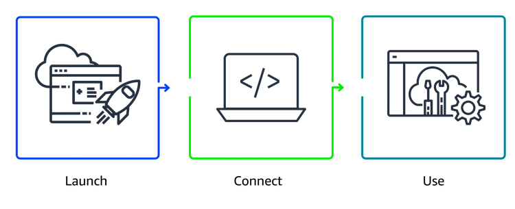

# Introduction to Amazon EC2

Remember our **coffee shop**? The **employee** who takes your order and makes your coffee is like a **server**. You (the customer) are the **client** who sends a request ("One latte, please!") and gets a response (the delicious latte).

**What is EC2?**
EC2 is like having a **virtual employee/computer in the cloud** that works for your business. Instead of buying and setting up a real, physical computer in a back room (which is slow and expensive), you can **rent a virtual one from AWS in minutes**.

*   **It's Fast:** You can get one running in **just a few minutes** by asking AWS for it.
*   **It's Flexible:** You only **pay for the time** it's actually running. Turn it off when you don't need it, and you stop paying!
*   **It's Powerful:** You can make it **bigger or smaller** anytime. Need more power? Make it bigger! Don't need as much? Make it smaller.

**How Does It Work? (The Magic Behind the Scenes)**
Imagine a **super-powerful physical computer** (a host machine) at an AWS data center. A special software called a **hypervisor** lets that one big computer pretend to be **many smaller, separate computers** (these are your EC2 instances).

*   This is called **multi-tenancy** (many "tenants" sharing one host).
*   The **hypervisor's job** is to make sure your virtual computer is completely **isolated and safe** from everyone else's virtual computers on the same machine. **AWS handles all of this for you.**

**You Are in Control!**
When you get your EC2 instance (your virtual computer), **you decide**:
1.  **The Operating System:** Do you want **Windows** or **Linux**?
2.  **The Software:** What do you want it to run? Your website? A game? A database? You install whatever you need.
3.  **The Size:** Start small. If you need more memory or a faster brain (CPU), you can **vertically scale** (make it bigger) with just a few clicks.
4.  **The Access:** You decide who can talk to it (like setting rules for who can visit your coffee shop).

**The Big Idea:**
AWS took the old idea of virtual computers (VMs) and made it **incredibly easy and cheap** to use. You get all the benefits of a powerful server **without** the hassle of buying, maintaining, and powering a physical machine. It's **Compute as a Service**—you just use the computing power you need, when you need it.

**Simple Summary:**
**EC2 = Your rent-a-computer in the cloud.**  
It's fast to get, easy to change, and you only pay while it's on. AWS keeps the physical machine safe and isolated, and you get to control everything that happens on your virtual computer.

## Key Takeaways: Your Cloud Computer (EC2) vs. Owning a Computer

Think of it like getting a computer for your business:

### **The Old Way (On-Premises): Like Buying a Whole Computer Store**
*   You have to **buy all the computers upfront**—a huge cost before you even start.
*   You have to **wait weeks** for them to be delivered.
*   You're **stuck** with what you bought. If you need more power later, you have to buy more. If you need less, you've wasted money.
*   You have to **set up, power, and fix** everything yourself.

**It's slow, expensive, and rigid.**

### **The AWS Cloud Way (EC2): Like Having a Magic Computer Vending Machine**
*   You can get a **virtual computer in minutes**, not weeks.
*   You **only pay** for the time it's turned on.
*   You can make it **bigger or smaller** with a click as your needs change.
*   **No maintenance**—AWS keeps the physical machines running.
*   It's **fast, flexible, and cost-effective.**

### **How to Use Your Cloud Computer (EC2) in 3 Easy Steps:**

**Step 1: Pick Your Computer (Launch)**
*   Go to the AWS "vending machine" and choose:
    *   **The Software (AMI):** Do you want Windows or Linux on it? Maybe with extra programs pre-installed?
    *   **The Size (Instance Type):** How powerful? A little computer for a small website, or a giant one for a big game?

**Step 2: Log In (Connect)**
*   Once it's running, you connect to it from your own laptop.
*   For **Linux**, you use `SSH` (like a secure phone call to the computer).
*   For **Windows**, you use `RDP` (like remotely controlling its screen).

**Step 3: Start Working (Use)**
*   Now it's yours! Use it just like any other computer:
    *   Install your website or app.
    *   Save files on it.
    *   Run your programs.

When you're done, just **turn it off** and stop paying!

---

**In a Nutshell:**
EC2 turns computing into a **utility**. You get **exactly the computer power you need, exactly when you need it**, without any of the headaches of owning physical hardware. It’s the foundation for running almost anything in the AWS cloud.

## **Amazon EC2 Instance Types Like Coffee Machines**

Think of EC2 instances as **different coffee machines** in a coffee shop. You need the right machine for each drink to run your shop efficiently.

### **The 5 "Coffee Machine" Families (Instance Types):**

1.  **General Purpose (The All-Rounder)**
    *   **Like:** A **good standard coffee maker** that can make decent espresso, drip coffee, and even froth milk okay. It does everything well.
    *   **Use it for:** Websites, app backends, or when you're just starting and aren't sure what you need. It's a safe, balanced choice.

2.  **Compute Optimized (The Speed Demon)**
    *   **Like:** A **super-fast, high-powered espresso machine** designed to pump out perfect shots as quickly as possible.
    *   **Use it for:** Tasks that need raw brainpower (CPU): video encoding, scientific simulations, game servers, or complex calculations.

3.  **Memory Optimized (The Big-Thinker)**
    *   **Like:** A **huge, specialized cold-brew tower** that needs to hold gallons of coffee in its system to work properly.
    *   **Use it for:** Workloads that need to hold **a lot of information in memory** at once: big databases, real-time analytics, or caching systems.

4.  **Accelerated Computing (The Specialized Artist)**
    *   **Like:** A **fancy, automated latte art machine** with special arms and tools. It uses specialized hardware (GPUs) to do things regular machines can't do efficiently.
    *   **Use it for:** Machine learning, 3D rendering, graphics processing, or complex physics simulations.

5.  **Storage Optimized (The High-Capacity Fridge)**
    *   **Like:** A **massive, super-fast refrigerator** that can instantly store and retrieve gallons of milk and syrup.
    *   **Use it for:** Workloads that need **super-fast read/write access to huge amounts of local data**: data warehouses, large NoSQL databases (like Cassandra), or log processing.

---

### **Size Matters (And So Does Cost!)**
*   Inside each family (like **General Purpose**), you can pick a **size**: small, medium, large, x-large.
*   **Bigger size** = More power (CPU, Memory, Storage) = **Higher cost**.
*   **The Goal:** Pick the **smallest size that does the job well**. Don't rent a monster truck to go to the grocery store. You can always change the size later if you need to!

### **The Superpower of the Cloud: Flexibility**
You are **not stuck** with your first choice! If you pick a `t3.medium` and realize you need more memory, you can easily change it to an `r5.large`. The cloud lets you **"right-size"** your resources as you learn more about what your application needs.

**Simple Summary:**
| **Instance Family** | **It's Like...** | **Best For...** |
| :--- | :--- | :--- |
| **General Purpose** | Reliable all-rounder coffee maker | Websites, starting out |
| **Compute Optimized** | Fast espresso machine | Number crunching, games |
| **Memory Optimized** | Large cold-brew tower | Big databases, analytics |
| **Accelerated Computing** | Fancy latte art robot | Graphics, machine learning |
| **Storage Optimized** | Super-fast, huge fridge | Big local data storage |

**Choose the right "machine" for the "drink" (workload) you're making!**

## **How to Provision AWS Resources**

