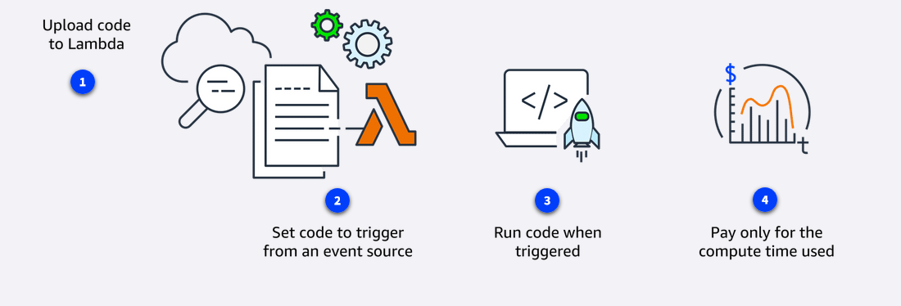
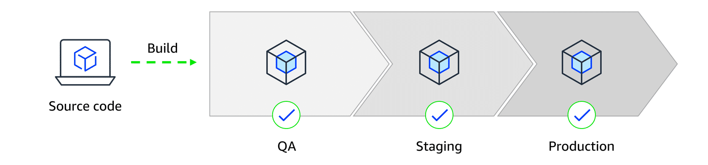
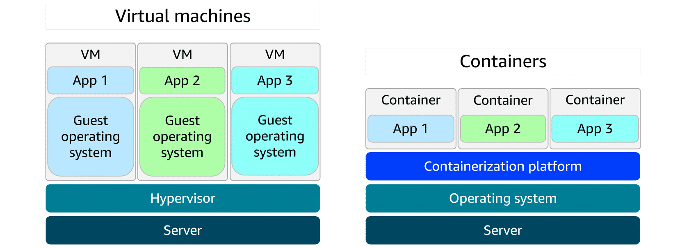
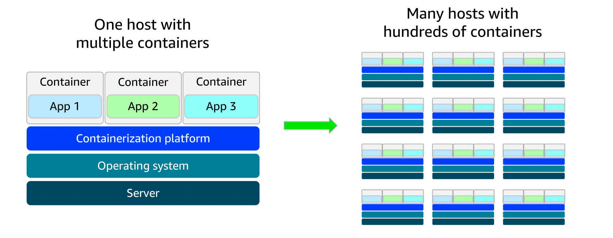

# Exploring Compute Services

## Introduction to Serverless Computing

**Introduction to Serverless Computing Explained Like Making Coffee**

You've learned how to run your own virtual computers (EC2) in the cloud. Now let's talk about a different, even easier way: **serverless computing**.

---

### **Unmanaged vs. Managed vs. Serverless: The Coffee Machine Analogy**

**1. Unmanaged Services (Like EC2) = The High-End Espresso Machine**
*   **You have FULL CONTROL.** You choose the beans, grind them, tweak every setting. You get the **perfect, custom cup**.
*   **BUT...** You also have **ALL THE WORK.** You must clean it, descale it, fix it when it breaks, and buy more beans. You're the **barista and the machine mechanic**.
*   **In AWS:** EC2 gives you a full virtual machine. **You manage** the OS, patches, scaling, security. AWS just provides the physical hardware.

**2. Managed Services (Like ELB, SQS) = The Pod Coffee Maker**
*   **It's CONVENIENT.** You pop in a pod, press a button. You get a **good, consistent cup** quickly, with **almost no cleanup**.
*   **You trade some control for ease.** You can't tweak the grind or pressure much, but you save huge time and effort.
*   **In AWS:** AWS runs the service for you. You **configure it** (e.g., set up a load balancer or a queue), and **AWS handles** the servers, scaling, and maintenance behind the scenes.

**3. Serverless Services = The Magical Coffee Genie**
*   You simply **wish for coffee**, and it **instantly appears**. No machine to buy, clean, or maintain. You don't even see where it comes from.
*   You **only pay for each cup** you actually wish for. No pods to stockpile.
*   **In AWS:** You just provide the **code** (the "coffee recipe"). AWS magically runs it **somewhere, on invisible infrastructure**, exactly when needed. **You manage NOTHING**—no servers, no scaling, no patches.

---

### **What "Serverless" Really Means**

*   **No servers to manage:** You never see, SSH into, or patch a server. AWS handles **all** the infrastructure.
*   **Automatic, infinite scaling:** If 1 person needs your app, it runs. If 1 million people need it a second later, it scales instantly. You don't configure this.
*   **Pay-per-use:** You are billed for the **exact compute time** your code runs (down to the millisecond), not for keeping servers idle.
*   **High availability by default:** Built-in fault tolerance across multiple Availability Zones.

**Key AWS Serverless Service: AWS Lambda**
*   You upload your **function** (a small piece of code, like "process an image" or "save to database").
*   You tell Lambda **when to run it** (e.g., "when a file is uploaded to S3" or "when an API is called").
*   **Lambda does everything else:** Provisions servers, runs your code, scales up/down to zero, and logs results.

---

### **Shared Responsibility in Serverless**

| **Service Type** | **AWS's Responsibility** | **Your Responsibility** |
| :--- | :--- | :--- |
| **Unmanaged (EC2)** | Security **OF** the Cloud (Physical data center, hardware) | Security **IN** the Cloud (OS, apps, data, firewall rules) |
| **Serverless (Lambda)** | **Everything** up to the runtime (Infrastructure, OS, scaling, patching) | **Your application code & its security** (What your code does, its dependencies, IAM permissions) |

**Think of it like renting:**
*   **EC2:** Renting an **empty house**. You're responsible for furniture, plumbing, painting.
*   **Lambda:** Renting a **hotel room by the hour**. The hotel provides everything (bed, towels, cleaning). You just stay there and sleep (run your code).

---

**Simple Summary: When to Use What?**

| Need... | Choose... | Because... |
| :--- | :--- | :--- |
| **Total control & customization** | **EC2 (Unmanaged)** | You want to manage the OS, install specific software, have long-running processes. |
| **Balance of control & convenience** | **Managed Services (ELB, RDS)** | You want AWS to handle the undifferentiated heavy lifting (scaling, maintenance) for a complex service. |
| **Maximum agility & zero ops** | **Serverless (Lambda)** | You have event-driven tasks, microservices, or APIs. You want to **just write code** and not think about servers. |

**The Big Idea:** AWS gives you a **spectrum of control**. Choose the right tool for the job.
*   **Be the Barista (EC2)** when you need fine-grained control.
*   **Use the Pod Machine (Managed Services)** for reliable, convenient components.
*   **Call the Coffee Genie (Serverless)** to build applications faster by focusing only on your business logic.

## AWS Lambda:
**AWS Lambda Explained Like a Crab Classifier App**

Think of building an app that identifies crab species from photos. Normally, you'd need to set up servers, scale them, and keep them running 24/7. That's a lot of work!

**Enter AWS Lambda: The "Function as a Service"**

### **What is Lambda?**
Lambda is like having a **magic assistant** for your code.

1.  **You give it a task** (a piece of code, called a **function**). Example: *"Analyze this crab photo and tell me the species."*
2.  **You tell it when to work** (set a **trigger**). Example: *"Run this task whenever a new photo is uploaded."*
3.  **Lambda does EVERYTHING else:** It finds a server, runs your code, scales if 1 or 1,000 photos arrive at once, and then shuts down. You **never see or manage the server**.

### **How It Works in 4 Simple Steps:**

1.  **Upload Your Code:** Write your function (e.g., in Python) and upload it to Lambda.
2.  **Set a Trigger:** Connect it to an **event source** (e.g., a new file in S3, a message in SQS, an API call).
3.  **It Runs Automatically:** When the event happens (e.g., a user uploads a crab pic), Lambda **instantly runs your code** with the event data.
4.  **Pay-Per-Use:** You pay **only for the milliseconds your code runs** + a tiny fee per request. No charge when idle.

### **Key Features & Limits:**
*   **Fully Managed:** AWS handles servers, security patches, scaling, high availability.
*   **Autoscaling:** From zero to thousands of parallel executions instantly.
*   **Time Limit:** A single function run can last up to **15 minutes max**. (Great for short tasks, not for long-running processes.)
*   **Many Languages:** Native support for Python, Node.js, Java, etc. You can bring your own runtime.
*   **Deep AWS Integration:** Easily connects to S3, SQS, DynamoDB, API Gateway, etc.

---

### **Real-World Examples:**

| Use Case | How Lambda Helps |
| :--- | :--- |
| **Social Media App (Image Processing)** | User uploads a photo → Lambda instantly **resizes it & applies filters** → Saves it. Scales automatically during upload spikes. |
| **News App (Personalization)** | User opens the app → Lambda **fetches news & customizes recommendations** → Returns a personal feed. Runs only when users are active. |
| **Online Game (Event Handling)** | Player scores a point → Lambda **updates leaderboard & player stats** in real-time. Handles millions of events during peak hours. |

---

### **Demo Recap: Lambda + SQS (Event-Driven Workflow)**

In the demo, we built a simple **event-driven pipeline**:

**Scenario:** Process messages from a queue automatically.

1.  **The Queue (SQS):** Like an **order board**. Messages (tasks) are placed here.
2.  **The Worker (Lambda):** A function named **"Lambert"** that processes messages.
3.  **The Trigger:** Configured so **ANY new message in the SQS queue automatically triggers Lambert**.
4.  **The Flow:**
    *   We added a message (*"This is a test message"*) to the SQS queue.
    *   **INSTANTLY**, Lambert woke up, grabbed the message, logged it, and deleted it from the queue.
    *   We checked the logs (CloudWatch) and saw the proof.
    *   **No servers were launched, no scaling rules set. It just worked.**

**Permissions Are Key:** We had to give Lambert an **"execution role"** (permissions) to read from the SQS queue. This is part of your **security responsibility** in the Shared Responsibility Model.

---

### **Lambda vs. EC2: When to Use Which?**

| Aspect | **AWS Lambda (Serverless)** | **Amazon EC2 (Unmanaged)** |
| :--- | :--- | :--- |
| **Management** | **No servers.** You manage only code. | **You manage everything:** OS, patches, scaling, servers. |
| **Scaling** | **Automatic & instant.** Scales to zero when not used. | **Manual or via Auto Scaling.** You configure scaling policies. |
| **Cost** | **Pay per request & execution time** (milliseconds). | **Pay for running instances** (by the second/hour), even if idle. |
| **Runtime** | **Max 15 minutes** per execution. | **Unlimited.** Run 24/7 processes. |
| **Use Case** | **Event-driven, short tasks:** APIs, file processing, real-time data. | **Long-running, full control:** Web servers, databases, custom software. |

**The Big Idea:**
Use **Lambda** when you want to **focus purely on business logic** and let AWS handle all the infrastructure. It's perfect for glue code, automation, and microservices that respond to events.

**Think of it as:**
*   **EC2 = Owning a car.** You drive, maintain, insure, and park it.
*   **Lambda = Calling an Uber.** You just get in, go where you need, and pay for the trip. No maintenance, no parking, no buying the car.

## Containers and Orchestration on AWS
**Containers and Orchestration on AWS Explained Like Shipping a Meal Kit**

Imagine you're a chef. Your signature dish works perfectly in your own kitchen, but when you try to cook it in a friend's kitchen, it fails. Why? Different oven, different pans, different ingredients.

**Containers** solve this! They are like **meal kits**.

---

### **What is a Container? (The Meal Kit)**
*   You pack **everything** needed for your dish into one box: **pre-measured ingredients (code), recipe (dependencies), and specific cooking instructions (configuration)**.

*   Anyone, anywhere, can open the kit and get the **exact same perfect dish**, no matter their kitchen.
*   **Benefits:** Consistent, portable, lightweight (shares the host kitchen's stove/water), starts cooking fast.

**Container vs. Virtual Machine (VM):**
*   **VM = Renting a full, separate kitchen** (with its own oven, sink, fridge). Heavy and slow to set up.
*   **Container = Using a meal kit in a shared kitchen.** Lightweight and fast.

---

### **The Problem: Managing 1,000 Meal Kits**
If you're shipping 1,000 meal kits a day, you can't manage them by hand. You need:
*   A system to track kits.
*   To know which kitchen is free to cook.
*   To restart a kit if the cooking fails.
*   To add more chefs during dinner rush.

This is **Container Orchestration**.

---

### **AWS Container Services: The Complete System**

#### **1. The Registry: Amazon ECR (Elastic Container Registry)**
*   This is the **warehouse** where you store your boxed meal kits (container images). It's secure, managed, and your delivery trucks know where to pick them up.

#### **2. The Orchestrator (The Manager)**
You have two main choices for the system that manages the cooking process:

*   **Amazon ECS (Elastic Container Service):** **AWS's own, streamlined manager.** Easier to learn and deeply integrated with AWS. You define your tasks, and it handles the rest.
*   **Amazon EKS (Elastic Kubernetes Service):** **Managed "Kubernetes".** Kubernetes (K8s) is the **popular open-source industry standard** for orchestration. EKS lets you run K8s on AWS without managing the control plane. More flexible but more complex.

#### **3. The Compute (The Kitchen Space)**
Where do the actual containers run? Two options:

*   **On EC2 (Your Own Kitchens):** You rent and manage the **virtual kitchens (EC2 instances)** yourself. You decide their size, you clean them, you fix the oven. **Full control, more work.**
*   **On Fargate (Serverless Kitchens):** AWS provides **invisible, managed kitchen space**. You just say, *"Cook this meal kit,"* and AWS finds the space, powers it, and cleans up. **No server management, pure focus on your containers.**

---

### **How the Pieces Fit Together: A Simple Flow**

1.  **Build & Store:** You create your container image (meal kit) and **push it to Amazon ECR** (the warehouse).
2.  **Choose Orchestrator:** You pick **ECS** (simple, integrated) or **EKS** (flexible, Kubernetes-standard).
3.  **Choose Compute:** You decide how to run them:
    *   **"I'll manage the kitchens"** → Use **EC2 launch type**.
    *   **"I don't want to see a kitchen"** → Use **Fargate launch type**.
4.  **Deploy & Scale:** You define your application (how many containers, their resources, networking). The orchestrator **automatically** pulls images from ECR, places them on compute (EC2/Fargate), scales them up/down, heals failures, and balances load.

---

**Decision Guide: Which AWS Container Service to Choose?**

| If you want... | Choose this Orchestrator... | And this Compute... | Because... |
| :--- | :--- | :--- | :--- |
| **Simple, AWS-native experience** | **Amazon ECS** | **Fargate** | Easiest start. No Kubernetes to learn, no servers to manage. |
| **Simple, but with server control** | **Amazon ECS** | **EC2** | You want AWS's simple orchestrator but need to manage the underlying VMs (for specific software or cost control). |
| **Industry standard & maximum flexibility** | **Amazon EKS (Kubernetes)** | **Fargate** | You need Kubernetes features or plan to run anywhere (hybrid/multi-cloud). No server management. |
| **Kubernetes with server control** | **Amazon EKS (Kubernetes)** | **EC2** | You need full control over the worker nodes (VMs) in your Kubernetes cluster. |

**What is Fargate?**
Fargate is **serverless compute for containers**. It's not an orchestrator; it's the **invisible kitchen space** that works with **both ECS and EKS**.
*   **With Fargate:** You describe your container (CPU, memory). AWS runs it. **You never see a server.**
*   **Without Fargate (using EC2):** You must provision, scale, and patch a cluster of EC2 instances to run your containers.

---

**Simple Summary:**

*   **Containers** = **Meal Kits** (consistent, portable application packages).
*   **Amazon ECR** = **Warehouse** (stores container images).
*   **Orchestrator (ECS/EKS)** = **Manager** (deploys, scales, heals containers).
*   **Compute Option:** 
    *   **EC2** = **Rent and manage your own kitchens.**
    *   **Fargate** = **Use AWS's invisible, serverless kitchens.**

**The Goal:** Use containers for **portable, efficient applications**. Use AWS container services to **automate all the complex management**, so you can focus on your application code, not the infrastructure.

## Additional Compute Services

You've learned the core compute tools (EC2, Lambda, Containers). Now, here are **specialized tools** for specific jobs.

---

### **1. AWS Elastic Beanstalk = The General Contractor**
*   **What it is:** You give it your **application code** and high-level specs, and it **builds and manages the entire infrastructure** for you: EC2 instances, load balancer, auto scaling, database, etc.
*   **Analogy:** You give a blueprint for a house to a **general contractor**. They hire the electrician, plumber, and roofer. You still **own the house** and can go in and change things, but they handled all the complex coordination.
*   **Best for:** Developers who want to **deploy web applications quickly** without becoming infrastructure experts, but still want the **ability to take over** the underlying AWS resources later.

---

### **2. AWS Batch = The Supercomputer Scheduler**
*   **What it is:** A service to run **massive, parallel computing jobs** (like rendering a movie, analyzing genomes, or running financial simulations).
*   **Analogy:** You have a **mountain of data to process**. AWS Batch is like a **brilliant manager** who automatically rents 10,000 computers (EC2 instances) for exactly the time needed, splits the work, runs it all, and then turns everything off.
*   **Best for:** Scientists, researchers, data analysts with **heavy number-crunching workloads** that don't run continuously, but in big batches.

---

### **3. Amazon Lightsail = The All-in-One Website Kit**
*   **What it is:** **Simple, predictable, low-cost VPS (Virtual Private Server) hosting**. Includes a virtual server, SSD storage, data transfer, DNS management, and a static IP—all for a fixed monthly price.
*   **Analogy:** Buying a **pre-furnished apartment** with utilities included. It's simple, you know the exact cost, and everything you need is there. Not as customizable as building your own house (EC2), but perfect to get started.
*   **Best for:** Simple websites, blogs, small business apps, development/testing, and people who want to **avoid the complexity** of the full AWS console.

---

### **4. AWS Outposts = The Cloud-In-A-Box for Your Office**
*   **What it is:** **AWS hardware you install in your own data center**. It runs true AWS services (like EC2, EBS, S3) locally, giving you a **seamless hybrid cloud**.
*   **Analogy:** A **Starbucks franchise inside your office building**. You get the **exact same coffee (AWS services)** and management as the public Starbucks (AWS Cloud), but it's physically in your building for low latency and data control.
*   **Best for:** Companies that **must keep data on-premises** (for latency, regulations, or legacy systems) but want to use AWS's APIs, tools, and operational model.

---

### **Quick Comparison Table:**

| Service | Think of it as... | Best For... | Key Trait |
| :--- | :--- | :--- | :--- |
| **Elastic Beanstalk** | **General Contractor** | Quick web app deployment with infrastructure automation | **"Just run my code."** (Infrastructure as code) |
| **AWS Batch** | **Supercomputer Scheduler** | Massive parallel computing jobs (science, analytics, rendering) | **"Process this enormous dataset."** (Job orchestration) |
| **Lightsail** | **All-in-One Website Kit** | Simple apps, blogs, predictable pricing, easy start | **"Simple and cheap hosting."** (Fixed-price VPS) |
| **Outposts** | **Cloud-in-a-Box** | Hybrid cloud, on-premises AWS services, low latency | **"AWS, but in my own data center."** (Hybrid infrastructure) |

---

**The Big Picture:**

AWS provides a **spectrum of control and abstraction**:

1.  **Maximum Control & Work:** You manage everything → **EC2**
2.  **Managed Infrastructure:** You provide code, AWS builds infra → **Elastic Beanstalk**
3.  **Serverless:** You provide function code, AWS does all the rest → **Lambda**
4.  **Container Orchestration:** You manage containers, AWS manages servers or clusters → **ECS/EKS**
5.  **Specialized Workloads:** Big batches → **AWS Batch** | Simple hosting → **Lightsail** | Hybrid cloud → **Outposts**