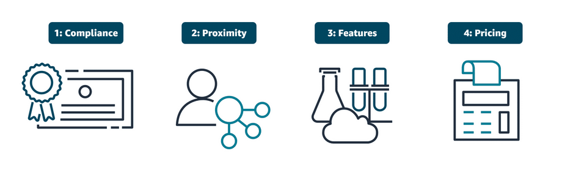

# Introduction to Going Global

Your coffee shop is a hit! Now it's time to take it worldwide.

### **Three Key Steps in Global Expansion & AWS Equivalents:**

**Step 1: Where to Open? (Choosing AWS Regions)**
*   **Coffee Shop:** You can't open a new shop *everywhere* at once. You must choose cities/countries based on **customer demand, local laws, and costs**.
*   **AWS Equivalent:** You don't deploy your app in *all* AWS Regions. You choose **AWS Regions** based on:
    *   **Latency:** Proximity to your users (e.g., European users → Paris Region).
    *   **Compliance/Regulations:** Data residency laws (e.g., GDPR in Europe).
    *   **Cost:** Regional price differences.
    *   **Service Availability:** Not all services are available in every Region.

**Step 2: Pop-Up Shops for Speed (Using AWS Edge Locations)**
*   **Coffee Shop:** To serve customers in busy spots (airports, stadiums) without building a full shop, you deploy **mobile coffee carts**. They carry only the **most popular items** for quick service.
*   **AWS Equivalent:** To deliver content (websites, videos) to users worldwide with **blazing speed**, AWS uses **Edge Locations**. These are tiny data centers **caching** your most popular content (images, videos) at the **edge of the network**, close to users. This is the core of **Amazon CloudFront** (AWS's Content Delivery Network).
    *   **Benefit:** A user in Tokyo gets your website's images from an **Edge Location in Tokyo**, not from your main server in Ohio. **Faster load times, less load on your origin.**

**Step 3: Consistency at Scale (Infrastructure as Code with CloudFormation)**
*   **Coffee Shop:** To ensure every new shop makes a **perfectly identical cappuccino**, you **automate and standardize**. You use the same espresso machines everywhere, program them with the same recipe, and train all baristas the same way.
*   **AWS Equivalent:** To deploy your infrastructure (servers, databases, networks) **identically, repeatedly, and reliably** across many AWS Regions, you use **Infrastructure as Code (IaC)**.
    *   **AWS CloudFormation** is the key IaC service. You write a **template** (a blueprint/recipe) describing your entire environment. With one click, you can deploy that exact same stack in **US-East-1, EU-West-1, and AP-South-1**.
    *   **Benefit:** No manual setup errors. Consistent, repeatable, version-controlled infrastructure.

---

### **The Big Picture: The AWS Global Infrastructure Layers**

| Your Coffee Chain | AWS Global Infrastructure | What It Does |
| :--- | :--- | :--- |
| **Headquarters (HQ)** | **Your "Home" AWS Region** | Where your primary application and data live. |
| **Full International Shops** | **AWS Regions** (e.g., `us-east-1`, `eu-central-1`) | Full-scale data centers with all services to run your full application. |
| **Mobile Coffee Carts** | **AWS Edge Locations / Points of Presence** | Hundreds of small sites worldwide that **cache and deliver content** for ultra-low latency. |
| **Standardized Recipe Book** | **CloudFormation Template (IaC)** | The **blueprint** to replicate your exact infrastructure anywhere, consistently. |

---

### **Why This Matters for Your Application:**

1.  **Performance:** Use **Regions** close to your users for your main app. Use **Edge Locations** (CloudFront) to cache static content globally.
2.  **Resilience (Disaster Recovery):** Deploy your app in **multiple Regions**. If one Region has an outage, traffic can fail over to another.
3.  **Compliance:** Choose Regions that meet your data sovereignty requirements (e.g., store EU citizen data only in EU Regions).
4.  **Scalability & Consistency:** Use **CloudFormation** to spin up identical test, staging, and production environments anywhere in the world, on demand.

**Simple Summary:**

*   Going global isn't just about picking spots on a map. It's a **strategic architecture**.
*   **AWS Regions** are your **primary data centers**.
*   **Edge Locations** are your **global content delivery network** for speed.
*   **CloudFormation** is your **automated deployment tool** for consistency.

## Choosing AWS Regions

Your coffee chain is expanding. Where do you open the next shop?

### **The 4 Key Factors (C.P.P.F.)**

Think of it like a checklist of priorities:

**1. Compliance & Regulations (The LAW) – *NON-NEGOTIBLE***
*   **Coffee Shop:** Some countries have strict food safety laws. You **must** follow them to open there.
*   **In AWS:** Data privacy laws (like **GDPR in Europe**) dictate where customer data can be stored. If your business handles German financial data, you **must** choose the **Frankfurt Region**. If you work with the U.S. government, you might **need** the special **AWS GovCloud** Region.
*   **Rule:** This is your **first filter**. If the law says your data must stay in a country, you pick a Region in that country. No other factors matter if you fail compliance.

**2. Proximity to Customers (The SPEED) – *CRITICAL FOR USER EXPERIENCE***
*   **Coffee Shop:** Open shops **close to your customers**. People won't travel 2 hours for coffee.
*   **In AWS:** Choose Regions **physically close to your users** to minimize **latency** (delay). If your users are mostly in Singapore, the **Singapore (ap-southeast-1)** Region will give them a much faster experience than **N. Virginia (us-east-1)**.
*   **Rule:** Low latency = Happy, fast-loading apps.

**3. Pricing (The COST) – *IMPACTS YOUR BUDGET***
*   **Coffee Shop:** Rent, labor, and taxes are different in Tokyo vs. São Paulo. Your operating costs vary.
*   **In AWS:** Service pricing **varies by Region** due to local electricity costs, taxes, and market factors. Running the same EC2 instance can cost **20-30% more** in one Region vs. another. Check the **AWS Pricing Calculator**.
*   **Rule:** After compliance and proximity, compare costs to optimize your budget.

**4. Feature & Service Availability (The TOOLBOX) – *CAN YOU BUILD WHAT YOU NEED?***
*   **Coffee Shop:** Can you get your specific espresso machine or special syrup in that country? Some ingredients might not be available.
*   **In AWS:** **Not all AWS services are available in every Region.** Newer or specialized services often launch in a few Regions first. For example, **AWS Ground Station** or certain AI services might only be in `us-east-1` initially. Check the **AWS Regional Services List**.
*   **Rule:** Ensure the Region has all the AWS services your application requires.

---

### **The Golden Rule of AWS Regions: ISOLATION**
Each AWS Region is **completely isolated** from the others.
*   **Think:** Shops in different countries with their own separate storage rooms.
*   **Data does NOT flow between Regions unless you explicitly configure it to.** This is a **security feature** that helps with compliance.
*   You must **replicate or deploy** your application separately in each Region you choose.

---

### **Quick Decision Framework:**

1.  **Start with COMPLIANCE:** *"Where am I legally allowed to put my data?"* This narrows your list.
2.  **Then PROXIMITY:** *"Where are my users?"* Pick the closest compliant Region(s).
3.  **Check FEATURE AVAILABILITY:** *"Does this Region have all the AWS services I need?"*
4.  **Finally, compare PRICING:** *"What's the most cost-effective Region among my shortlist?"*

**Example Scenarios:**
*   **A startup in Australia** targeting Australian users: Choose **`ap-southeast-2` (Sydney)**. It's compliant, close, has core services, and pricing is localized.
*   **A global SaaS company** with EU and US customers: Deploy in **`eu-central-1` (Frankfurt)** for GDPR compliance *and* **`us-east-1` (N. Virginia)** for US speed and feature richness. Use a **Global Accelerator** or **CloudFront** to route users to the closest Region.

**Simple Summary:**

Choosing a Region is a **business decision**, not just a technical one. Use the **C.P.P.F. framework**:

**C**ompliance → **P**roximity → **P**ricing → **F**eature Availability.

## Diving Deeper into AWS Global Infrastructure
Think of AWS as building the world's most reliable and fastest fast-food chain for your digital content and apps.

---

### **1. The Foundation: High Availability (Keeping the Doors Open)**

**Problem:** If one restaurant (data center) loses power or has a leak, it has to close.
**Solution:** Build **multiple restaurants (Availability Zones)** in the **same city (Region)**.

*   **Multi-AZ Architecture:** Like having **3 identical coffee shops in different neighborhoods of the same city**. If one floods, the other two are open. Your customers (users) are automatically routed to the open ones.
*   **Benefit:** Your application stays up. **Fault tolerance within a Region.**

**Go Bigger: Multi-Region Architecture**
*   **Problem:** A huge storm shuts down the **entire city (Region)**.
*   **Solution:** Open **identical chains in different cities (Regions)**. (e.g., shops in Paris, Tokyo, and Ohio).
*   **Benefit:** **Disaster Recovery.** If Paris has a blackout, traffic fails over to Tokyo. Your global app stays online.

**It's a Pinball Game:** Managing multiple locations is tricky at first (like keeping multiple pinballs in play), but with practice (and AWS tools), it becomes manageable and powerful.

---

### **2. The Need for Speed: Edge Locations (The Delivery Scooters)**

**Problem:** A customer in Sydney, Australia, orders from your coffee shop in **Ohio (the Region)**. That's a long wait for their latte (data)!

**Solution: Amazon CloudFront & Edge Locations**
*   **Edge Locations** are like **small, local storage lockers** for your most popular items (images, videos, memes), placed in **thousands of neighborhoods (cities) worldwide**.
*   **How it works:** The first time someone in Sydney requests your meme, it's fetched from Ohio and **cached (stored)** in the Sydney edge location. The **next** person in Sydney gets it **instantly** from the local edge locker.
*   **Benefit:** **Super low latency.** Content is served from the **closest possible location** to the user.

---

### **3. The Signpost: Amazon Route 53 (DNS)**

**Problem:** Users have to remember the exact street address (IP address) of your shop.
**Solution:** **Route 53** is the **phonebook and smart traffic director**.
*   It translates your website name (`rudyscoffee.com`) into the actual IP address.
*   It **routes users to the healthiest, closest location** (e.g., to the open shop in Tokyo if Paris is down).

---

### **4. The On-Premises Cafe: AWS Outposts**

**Problem:** You need the **speed of a local shop** AND the **exact same menu/management as the AWS chain** inside your own office building (for data control or ultra-low latency).
**Solution: AWS Outposts** is like a **licensed, fully AWS-managed Starbucks franchise installed in your office lobby**. It runs real AWS services on physical AWS hardware you own. It's **AWS, but on your premises.**

---

### **The Three Key Elements - Visualized:**

| Element | Analogy | Purpose |
| :--- | :--- | :--- |
| **AWS Region** | A **major city** (e.g., "AWS City - Paris"). | A large geographical area hosting a full suite of AWS services. Contains multiple, isolated data centers. |
| **Availability Zone (AZ)** | A **neighborhood** in that city (e.g., "Paris - North", "Paris - South", "Paris - Central"). | Isolated locations **within a Region** for redundancy. If one AZ fails, others in the same Region take over. |
| **Edge Location** | **Local storage lockers & delivery hubs** in **thousands of towns and suburbs worldwide**. | **Cache content** close to end-users for **fast delivery**. They don't run full AWS services, just caching and routing. |

---

### **The Three Advantages of This Design:**

1.  **High Availability:** Your system **doesn't fail**. Built through **Multi-AZ** and **Multi-Region** designs.
2.  **Agility:** You can **deploy new "shops" (resources) globally in minutes**, adapting quickly to new markets or demands.
3.  **Elasticity:** Your infrastructure can **automatically grow or shrink** (scale) based on customer demand, thanks to the on-demand nature of the cloud.

---

### **Putting It All Together - A User's Request Journey:**

1.  A user in **London** types `www.your-app.com`.
2.  **Route 53 (DNS)** directs them to the **closest and healthiest Region** (e.g., EU - Ireland).
3.  Within that Region, a **Load Balancer** directs the request to an EC2 instance in **Availability Zone 1**.
4.  The app serves dynamic content from there, but the logo and meme images are **served from a London Edge Location** via **CloudFront** (blazing fast).
5.  If AZ 1 fails, the Load Balancer sends traffic to **AZ 2**. Users don't notice.
6.  If the whole Ireland Region had an issue, **Route 53** would fail all traffic over to the **US East Region**. Service continues.

**Simple Summary:**
*   Use **Regions & AZs** for **resilience and core computing**.
*   Use **Edge Locations & CloudFront** for **global speed**.
*   Use **Route 53** for **smart routing and failover**.
*   Use **Outposts** when you need **AWS physically in your building**.

This global infrastructure is why AWS can deliver secure, durable, high-performance, and low-latency applications to customers anywhere in the world.

## Infrastructure and Automation