# Introduction to Networking
Imagine our coffee shop has two areas:

1.  **The Front of House (Public Area):** Where **cashiers (public resources)** interact with **customers (internet users)**. This area needs a door to the street.
2.  **The Back of House (Private Kitchen):** Where **baristas (private resources)** make drinks. This area should **NOT** have a door to the street. Only employees can go here.

In AWS, the **Amazon Virtual Private Cloud (VPC)** is your **entire, private coffee shop building** in the cloud. It's your own isolated space.

---

### **Key Concept: Subnets (Rooms Inside Your Shop)**
You divide your VPC (building) into **rooms**, called **subnets**.

* **Public Subnet:** A room **with a door to the street**. You put resources here that need to talk to the internet.  
*➡️ Example: The **cashiers (web servers/load balancers)** that take customer orders.*

* **Private Subnet:** A room **with NO door to the street**. Resources here are isolated from the public internet.  
*➡️ Example: The **baristas (application/database servers)** that make the drinks. They only talk to the cashiers.*

**Why is this important?**
* **Security:** Customers can't wander into the kitchen and mess with the baristas or recipes (your data).
* **Organization:** You can clearly separate and control access to different parts of your application.

---

**How It Works (The Simple Flow):**
1.  A **customer (internet user)** walks into the shop's **public area (public subnet)** and talks to a **cashier (public EC2 instance)**.
2.  The **cashier** takes the order, walks through an **internal door (internal network)**, and gives it to a **barista (private EC2 instance)** in the **kitchen (private subnet)**.
3.  The **barista** makes the drink and hands it back to the cashier. The customer **never directly interacts** with the barista.

**This is the foundational pattern for secure cloud architecture.**

---

### **Understanding Diagrams (The Blueprint)**

Architects use **diagrams** as blueprints. For our coffee shop, a simple diagram would show:

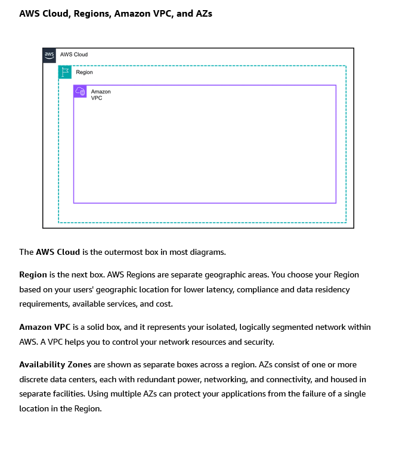

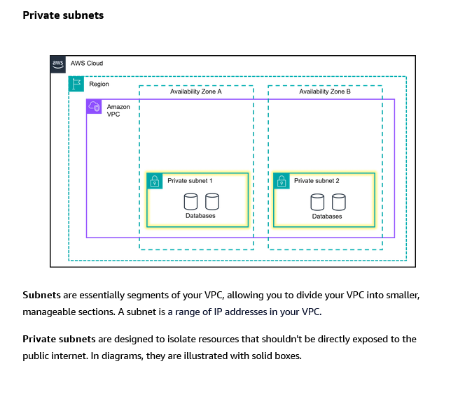

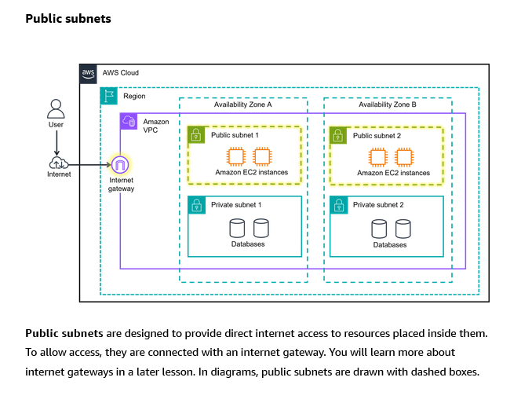

**With one glance you can see:**
* **Security:** The database is safely tucked away in the private subnet.
* **Redundancy:** You might see multiple cashiers (for scaling).
* **Scalability:** You can easily add more baristas in the private subnet as needed.

---

**Simple Summary:**

* **Amazon VPC:** Your **private, virtual network** (your entire coffee shop building) in AWS.
* **Subnet:** A **segment/room** within your VPC. Used to organize and control access.
    * **Public Subnet:** Has a route to the internet. For front-facing services.
    * **Private Subnet:** No direct internet route. For backend services and data.
* **The Goal:** Use **public subnets** for resources that serve users, and **private subnets** to **protect your core application logic and data**. This creates a secure, layered architecture.

## Organizing AWS Cloud Resources

Let's build on the coffee shop analogy to understand how you connect your private network (VPC) to the outside world.

---

### **Recap: VPC & Subnets (The Building & Rooms)**
*   **VPC:** Your **entire private coffee shop building** in the cloud. It has its own private address space.
*   **Subnets:** **Rooms** inside the building. You decide which rooms have a door to the street.

---

### **How Do People Get In? The Gateways**

You need controlled entrances to your building (VPC). AWS provides different types of doors:

#### **1. Internet Gateway (IGW) = The Main Public Front Door**
*   **What it is:** A doorway that connects your VPC to the **public internet**.
*   **Analogy:** The **main glass entrance** of the coffee shop on the public street. Anyone (internet traffic) can walk in.
*   **Used for:** Resources in **public subnets** that need to talk to the internet (e.g., your website, load balancer).
*   **Rule:** **No IGW = No public internet access** for your VPC.
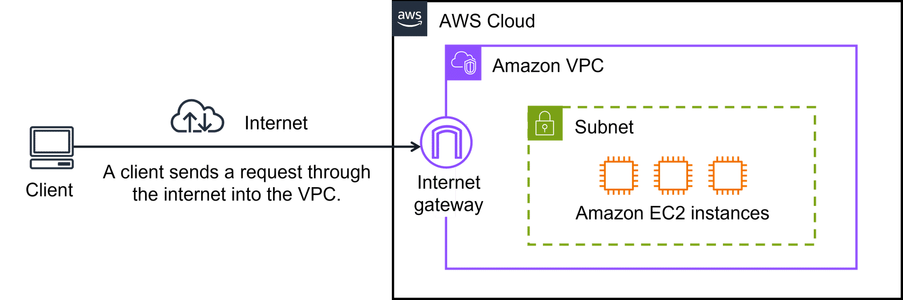

#### **2. Virtual Private Gateway (VGW) = The Secure Employee/Partner Entrance**
*   **What it is:** A doorway that connects your VPC to a **private network** (like your office's internal network) via a **VPN (Virtual Private Network)**.
*   **Analogy:** A **secure, badge-access door** at the back of the corporate office building. Only employees/partners with a badge (VPN credentials) coming from the approved office network can enter.
*   **Used for:** Creating a **secure, encrypted tunnel** over the public internet to connect your **on-premises data center** to your AWS VPC.
*   **Key Point:** Traffic is **encrypted** as it travels over the shared public internet (the "crowded streets").
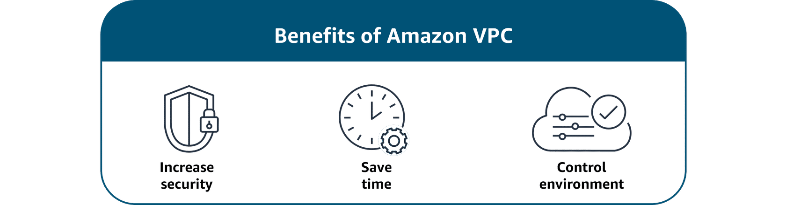

---

### **The Problem with VPN (The Shared Hallways)**
Using a VPN (via the Virtual Private Gateway) is like employees having to:
1.  Badge in at the secure door.
2.  Walk through **shared, crowded hallways and elevators** (the public internet) to get to the coffee shop (VPC).

**It's secure, but can be slow and unpredictable** due to shared public network congestion.

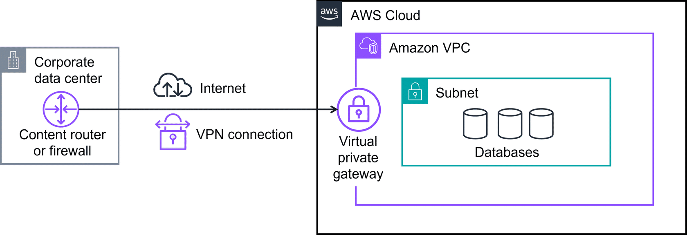
---

### **The Solution: AWS Direct Connect = The Private, Dedicated Magic Tunnel**
*   **What it is:** A **physical, dedicated fiber-optic cable** from your data center directly to an AWS facility. **No shared public internet involved.**
*   **Analogy:** A **private, underground express tunnel** built just for your company, connecting your office basement directly to the coffee shop's kitchen.
*   **Benefits:**
    *   **Consistent High Speed:** No congestion.
    *   **Increased Reliability:** Dedicated line.
    *   **Lower Latency:** Faster data transfer.
    *   **Cost-Effective** for high-volume data.
*   **Use Case:** Critical, high-bandwidth applications (like financial trading, media streaming, large data migrations) that need predictable performance.

---

### **Key Acronyms Demystified (They Sound Similar!)**

| Acronym | What It Is | Simple Analogy |
| :--- | :--- | :--- |
| **VPC** (Virtual Private Cloud) | Your **entire private network** in AWS. | The **whole coffee shop building**. |
| **VPN** (Virtual Private Network) | The **encrypted tunnel** over the public internet. | The **secure, invisible tube** inside the crowded public streets. |
| **IGW** (Internet Gateway) | The **public door** to the internet for your VPC. | The **main glass front door** of the shop. |
| **VGW** (Virtual Private Gateway) | The **AWS-side endpoint** for your VPN connection. | The **secure, locked doorframe** on the AWS building where your VPN tunnel attaches. |

---

**Simple Summary: How to Connect to Your VPC**

| If you want to... | Use this... | Because... |
| :--- | :--- | :--- |
| **Let the public internet access your web servers** | **Internet Gateway (IGW)** + **Public Subnet** | You need a public door for customer traffic. |
| **Securely connect your office to AWS over the internet** | **Virtual Private Gateway (VGW)** + **VPN** | It's a cost-effective, secure tunnel using existing internet. |
| **Get a fast, dedicated, private line to AWS** | **AWS Direct Connect** | You need maximum performance, reliability, and bandwidth for critical apps. |

**The Goal:** Choose the right "door" based on **who needs access** (public vs. private) and **what performance** you need (shared internet vs. dedicated line). This gives you complete control over network security and connectivity.

## More Ways to Connect to the AWS Cloud

Think of your **AWS VPC** as a **secure corporate campus**. Your employees and partners need different ways to get there, depending on who they are and where they're coming from.
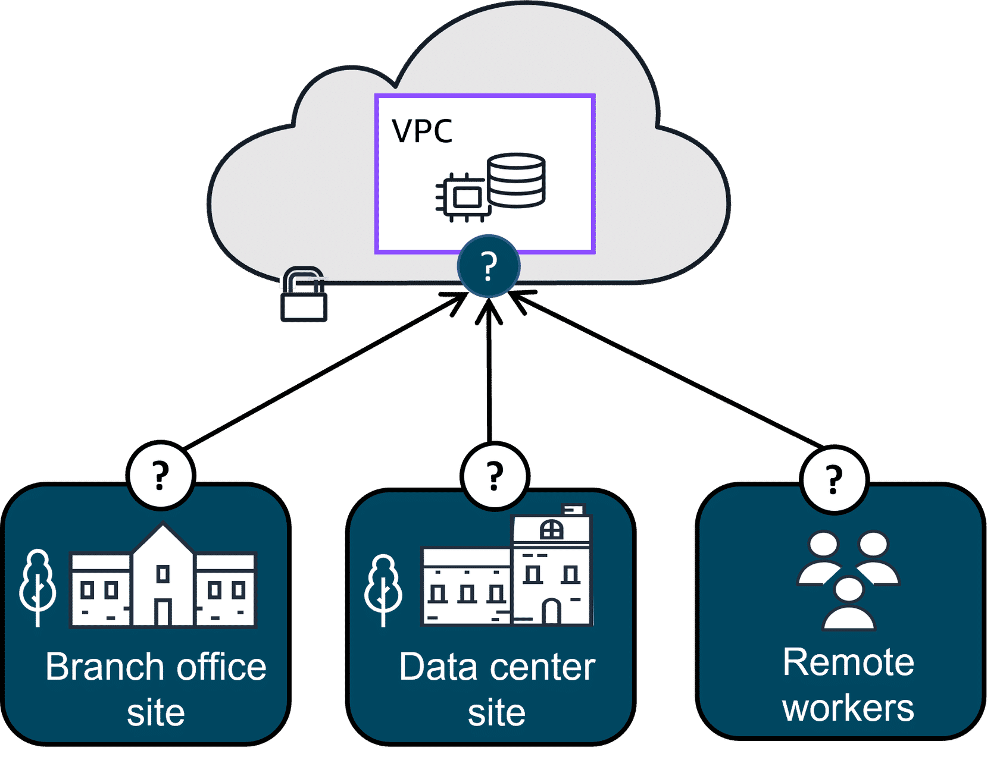

---

### **1. For Remote Employees: AWS Client VPN**
*   **What it is:** A **managed VPN service** for **individual users** (like remote workers) to securely connect to AWS or your corporate network from anywhere.
*   **Analogy:** Giving each employee a **secure keycard** that works on any public bus (internet) to enter a **private, encrypted tunnel** that leads directly to the corporate campus gate.
*   **Key Features:**
    *   **Fully Managed:** No VPN hardware to manage.
    *   **Elastic:** Scales automatically as you add/remove users.
    *   **Advanced Auth:** Integrates with your company's identity system (like Active Directory).
*   **Use Case:** **Secure remote work.** Quickly onboard a new remote team or an acquired company.

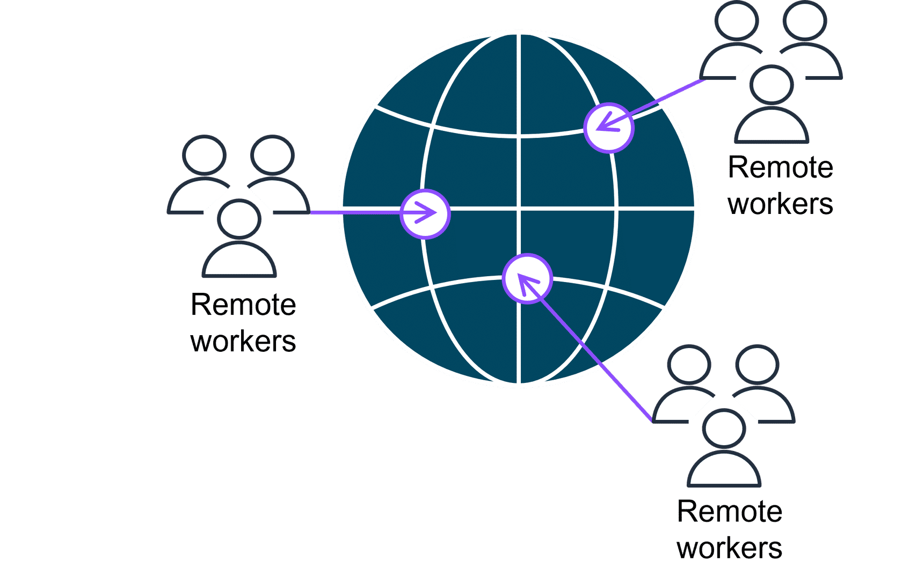

---

### **2. For Connecting Offices: AWS Site-to-Site VPN**
*   **What it is:** Creates a **secure, encrypted tunnel** between your **entire on-premises network** (data center or branch office) and your AWS VPC.
*   **Analogy:** Building a **secure, dedicated bus route (tunnel)** over the public roads (internet) that connects your **office building's parking garage** directly to the **corporate campus garage**. All employees from that office use this route.
*   **Key Features:**
    *   **Network-to-Network:** Connects entire locations.
    *   **High Availability:** Can be set up with redundant tunnels.
*   **Use Case:** **Hybrid cloud.** Connecting your data center to AWS for application migration or ongoing hybrid operations.

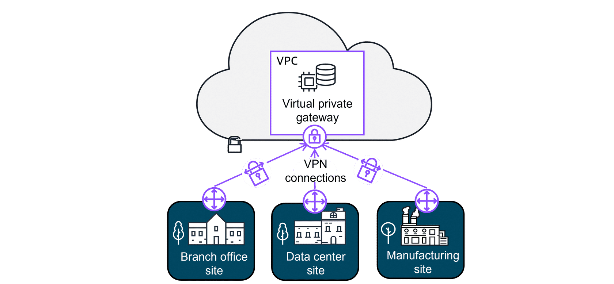

---

### **3. For Private Service Access: AWS PrivateLink**
*   **What it is:** Allows you to **privately access services** (AWS services, your own services in another VPC, or partner SaaS) **as if they were in your own VPC**, without using the public internet, IGW, or VPN.
*   **Analogy:** A **private, underground utility line** running directly from your corporate campus to a **specific supplier's warehouse (service)**. No one else can see or use this line. It's not a door for general traffic; it's a dedicated pipe to one service.
*   **Key Benefit:** **Extreme security.** Your traffic never touches the public internet. The service endpoint is only exposed to your VPC.
*   **Use Case:** Accessing **AWS services** (like S3) privately from a private subnet, or securely consuming **third-party SaaS** or **internal microservices** across VPCs.

---

### **4. For Dedicated Performance: AWS Direct Connect**
*   **What it is:** A **physical, dedicated fiber-optic connection** from your premises to AWS.
*   **Analogy:** Building a **private, company-owned highway** from your office directly to the AWS campus. No public traffic, no stoplights, maximum speed and reliability.
*   **Key Benefits:**
    *   **Consistent, High Bandwidth**
    *   **Lower Latency**
    *   **Reduced Data Transfer Costs**
*   **Use Case:** **Latency-sensitive apps** (video conferencing, gaming), **large data migrations**, or **predictable hybrid cloud** performance.

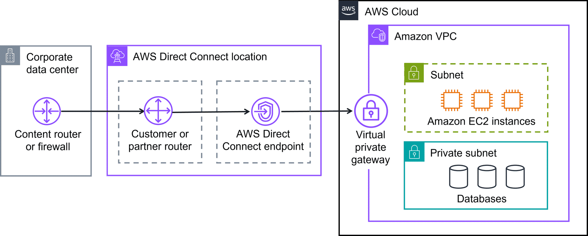

---

### **Additional "Traffic Controllers" (Gateways)**

*   **AWS Transit Gateway:** The **central traffic hub**. Connects **many VPCs and on-premises networks** (via VPN or Direct Connect) together in a simple star topology. Think of it as a **grand central station** for your cloud network.
*   **NAT Gateway:** Allows resources in a **private subnet** (no internet door) to **initiate outbound connections** to the internet (e.g., for software updates) while **blocking all unsolicited inbound traffic**. Like a **one-way mail chute**—they can send requests out, but no one can send requests in through it.
*   **Amazon API Gateway:** A fully managed service to **create, publish, and secure APIs**. It's the **front desk/receptionist** of your application, handling all client requests, routing them to the right backend service (like Lambda or EC2), and managing traffic.

---

**Simple Summary: Which Connection to Use?**

| If you need to connect... | Use this... | Think of it as... |
| :--- | :--- | :--- |
| **Individual remote users** to AWS | **AWS Client VPN** | Personal secure keycards for the public bus. |
| **Your entire office/data center** to AWS | **AWS Site-to-Site VPN** | A secure bus route between garages. |
| **Privately to a specific service** (no internet) | **AWS PrivateLink** | A private underground utility pipe. |
| **With max performance & reliability** | **AWS Direct Connect** | A private company highway. |
| **Many VPCs and networks together** | **AWS Transit Gateway** | A grand central station for cloud traffic. |
| **Private instances to talk out to the internet** | **NAT Gateway** | A one-way mail chute. |
| **To create a secure, scalable front door for your app** | **Amazon API Gateway** | A managed receptionist and security desk. |

**The Goal:** AWS provides a **complete toolbox** for every possible connectivity need—from securing a single laptop to building a global, high-performance hybrid network. Choose the right tool for the specific job.

## Subnets, Security Groups, and Network Access Control Lists
Think of your **VPC** as a **secure apartment complex**. You need to control who can enter the complex, who can enter specific buildings, and who can enter specific apartments.

---

### **The Apartment Complex Analogy:**

*   **VPC:** The **entire gated apartment complex**.
*   **Subnet:** A **specific building** within the complex. You have **Public Buildings** (with a main gate to the street) and **Private Buildings** (no street access).
*   **EC2 Instance:** An **apartment** inside a building.
*   **Network ACL:** The **security checkpoint at each building's entrance/exit**. It checks everyone going in or out of the **entire building (subnet)**.
*   **Security Group:** The **apartment door's peephole and lock**. It controls who can enter **your specific apartment (EC2 instance)**.

---

### **Key Differences: Security Groups vs. Network ACLs**

| Feature | **Security Group (The Apartment Door)** | **Network ACL (The Building Checkpoint)** |
| :--- | :--- | :--- |
| **Scope** | **Instance-level.** Protects **ONE EC2 instance**. | **Subnet-level.** Protects **ALL instances in a subnet**. |
| **State** | **Stateful (Has Memory).** If you let a guest in, it **remembers** and lets them back out automatically. | **Stateless (No Memory).** It checks **every single person** entering *and* exiting the building, every time. |
| **Rules** | **Allow rules ONLY.** You define who is **allowed** in. Default: **ALL OUTBOUND allowed, NO INBOUND allowed**. | **Allow AND Deny rules.** You can create "allow" lists and explicit "deny" lists. |
| **Return Traffic** | **Automatically allowed** for any connection it permitted inbound. | **Must be explicitly allowed** by a separate outbound rule. |
| **Analogy** | The lock on your apartment door. You give keys to friends. | The security guard at the building lobby who checks IDs against a list. |

---
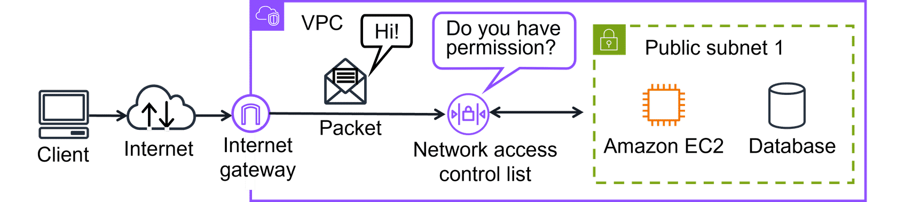

### **How a Packet Travels: A Visit Story**

**Scenario:** Apartment **A** (in Building 1) wants to visit Apartment **B** (in Building 2).

1.  **Leaving Apartment A:**
    *   **Security Group (A's Door Lock):** "Going out? Bye!" **✅ (All outbound allowed.)**
    *   **Network ACL (Building 1's Lobby - Exit):** Security guard checks the "Who can leave" list. Is Apartment A on it? **✅ (If rule allows.)**

2.  **Entering Building 2:**
    *   **Network ACL (Building 2's Lobby - Entrance):** New security guard checks the "Who can enter" list. Is the visitor from Apartment A allowed? **✅ (If rule allows.)**
    *   **Security Group (B's Door Lock):** Apartment B's owner checks their "Allowed Guests" list. Is Apartment A on it? **✅ (If rule allows.)** Guest enters.

3.  **The Return Trip Home:**
    *   **Security Group (B's Door):** "Leaving? Bye!" **✅ (Return traffic is auto-allowed because the connection was established.)**
    *   **Network ACL (Building 2's Lobby - Exit):** Guard checks the "exit" list again. **Must be explicitly allowed.**
    *   **Network ACL (Building 1's Lobby - Entrance):** Guard checks the "entrance" list again. **Must be explicitly allowed.**
    *   **Security Group (A's Door):** "Welcome back!" **✅ (Return traffic auto-allowed.)**

**The Key Insight:** The **Network ACL guards check their lists EVERY SINGLE TIME** you cross the building boundary, in both directions. The **Security Group door locks only check when someone first tries to enter**.

---

### **Default Behavior & Best Practices**

*   **Security Group (Default):** **DENY ALL INBOUND, ALLOW ALL OUTBOUND.** You must **add "Allow" rules** to let any traffic in (e.g., Port 80 for web, Port 22 for SSH).
*   **Network ACL (Default - Custom):** **DENY ALL INBOUND & OUTBOUND.** You must add both **Inbound AND Outbound "Allow" rules** for traffic to flow. (The *default* NACL that comes with a VPC allows everything, but it's best practice to create custom, restrictive ones.)

**Best Practice: Layered Security (Defense in Depth)**
1.  **Network ACLs (Broad Layer):** Act as a **coarse filter** at the subnet level. Example: "Block all traffic from this malicious IP range for the entire database subnet."
2.  **Security Groups (Fine-Grained Layer):** Act as a **precise filter** at the instance level. Example: "Only allow the web server security group to talk to the database on port 3306."

---

**Simple Summary Table:**

| Question | Answer with Security Group | Answer with Network ACL |
| :--- | :--- | :--- |
| **What does it protect?** | A single **EC2 instance** (apartment). | An entire **subnet** (building). |
| **Does it remember connections?** | **YES (Stateful).** | **NO (Stateless).** |
| **Can I make a "Deny" rule?** | **NO.** Only "Allow". | **YES.** Both "Allow" and "Deny". |
| **Who manages return traffic?** | **Automatically.** | **You must write rules for both directions.** |
| **Use it for...** | **Precise, instance-level rules.** | **Broad, subnet-level rules and explicit denials.** |

**The Bottom Line:**
You use **both** for defense in depth. Think of **Network ACLs as the building's security** and **Security Groups as your apartment's lock**. You need both to be truly secure. This is **your responsibility** under the AWS Shared Responsibility Model to secure your resources **IN** the cloud.

Remember the AWS Shared Responsibility Model? When it comes to securing the subnets and resources in your VPC with network ACLs and security groups, that is your responsibility. These components make up networking traffic protection and are critical defenses in protecting your applications IN the cloud.