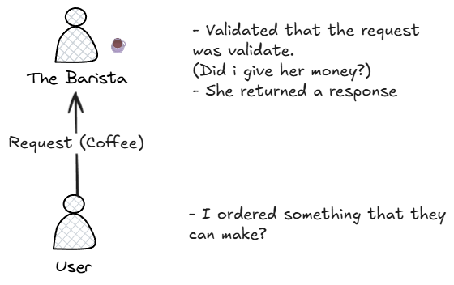

# Introduction to the Cloud

## Describe the client-server model at a fundamental level.

**An example a coffee shop:**

You only pay for what you use.

--- 
## What is Cloud Computing?
On-demand **delivery on IT resources** _over the internet_ with pay-as-you-go pricing.

Definitions of cloud computing:
- **On-demand delivery:** customers can access computing resources, such as storage or compute power,
within seconds and as needed. Users can scale their resource usage up or down based on current 
requirements without lengthy provisioning processes.
- **of IT resources:** the wide array of information technology assets in the cloud-computing space. 
These resources include servers, storage solutions, databases, networking components, artificial 
intelligence and machine learning (AI/ML) tools, and more. Customers can use these resources to build, 
deploy, and manage applications and services through the cloud infrastructure.
- **over the internet:** cloud computing delivers IT resources through internet connectivity. 
This means that users access and use these resources through web-based services rather than maintaining local hardware or software. The internet acts as the conduit, which provides remote access to compute 
power, storage, and applications from anywhere in the world.
- **with pay-as-you-go-pricing:** Flexible pricing is a fundamental economic aspect of cloud computing.
Users pay only for the resources they actually consume, rather than committing to fixed, long-term 
contracts. This usage-based pricing model offers cost efficiency and financial flexibility.

### Cloud deployment types
1. **Cloud:** you have the flexibility to migrate your existing resources to the cloud, design and 
build new applications within the cloud environment, or use a combination of both.
2. **On-premises:** Deploying resources on premises using virtualization and resource management 
tools does not provide many of the benefits of cloud computing. However, it is sometimes sought for 
its ability to provide dedicated resources and low latency.
3. **Hybrid:** cloud-based resources and on-premises infrastructure work together. This approach is 
ideal for situations where legacy applications must remain on premises due to maintenance preferences
or regulatory requirements.

## Benefits of the AWS Cloud
Six key benefits of cloud computing.

